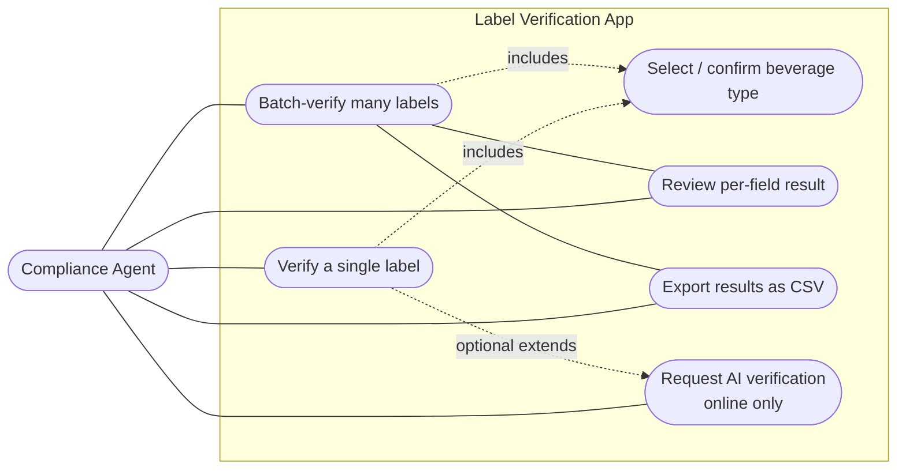
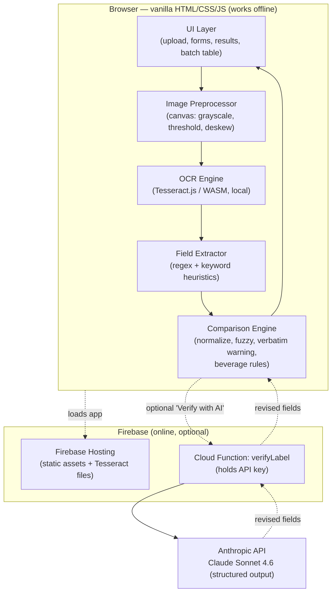
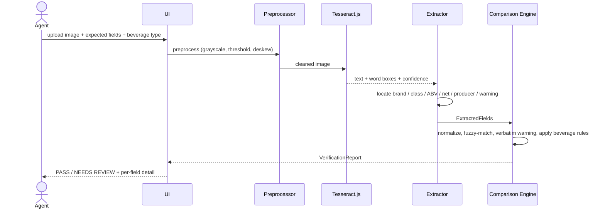
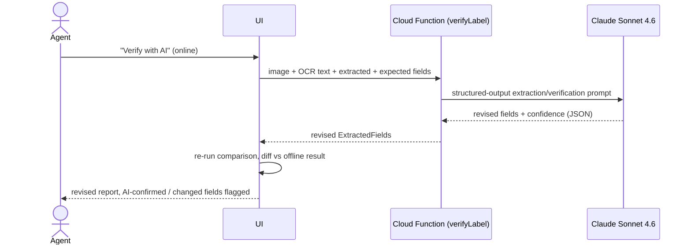
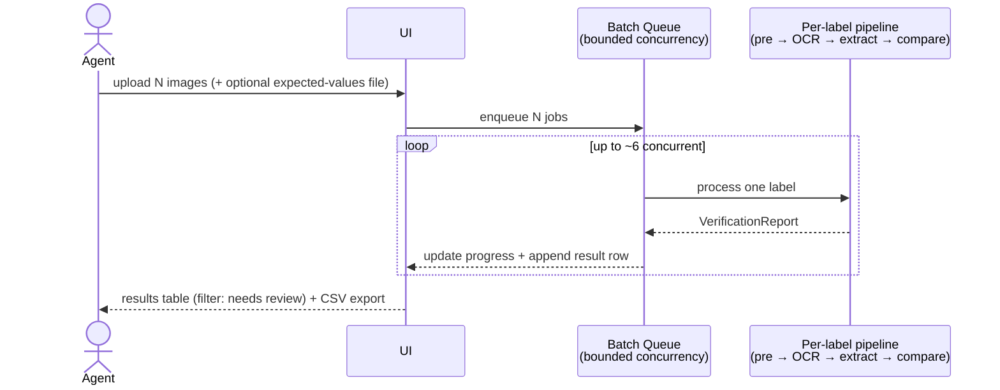
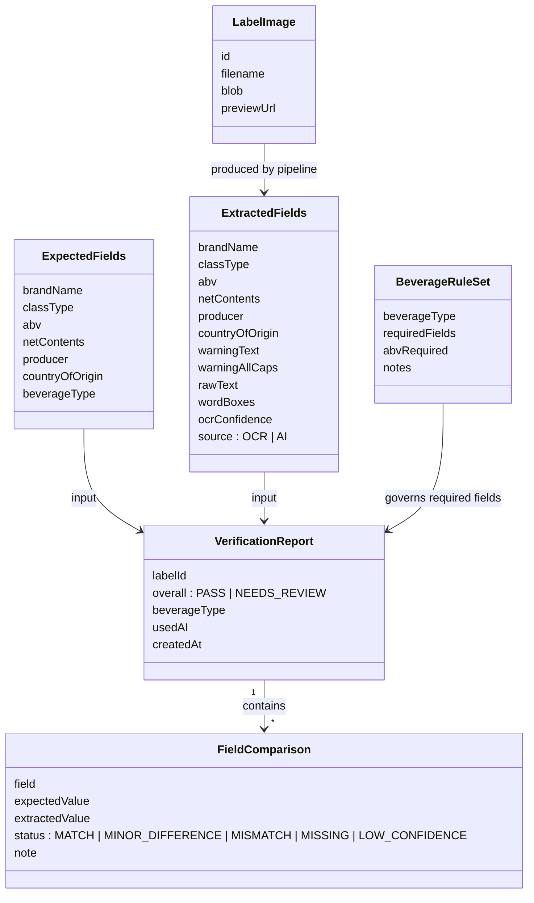
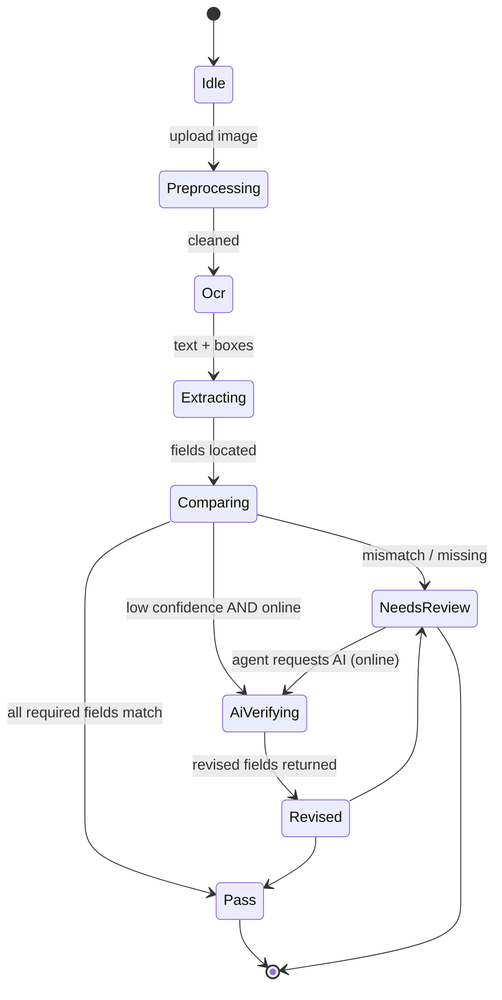
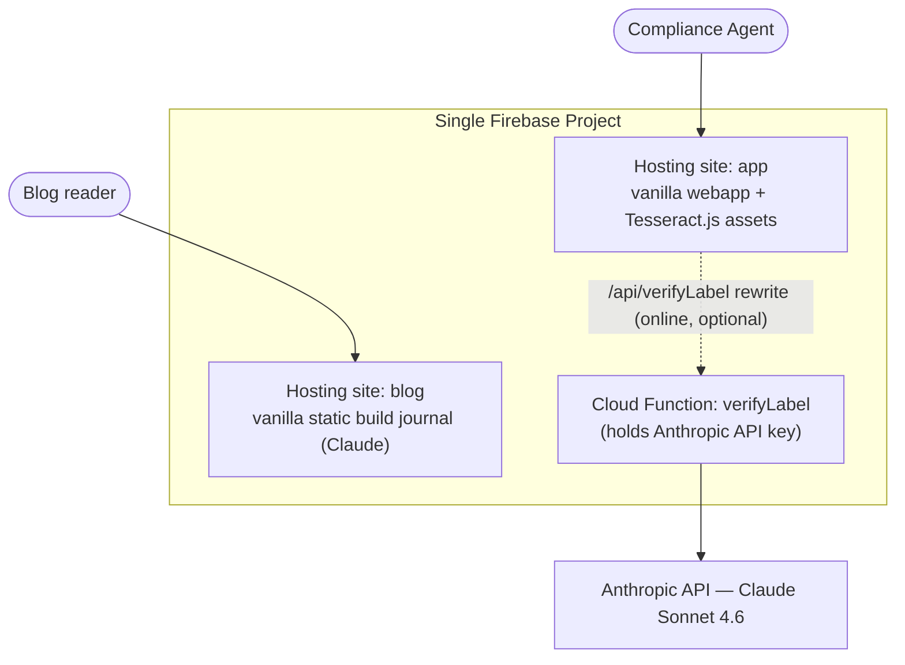

# UML / Architecture Diagrams — Label Verification Prototype

> Draft v1 for review. These reflect the **offline-first** architecture in
> [`PLAN.md`](./PLAN.md): a client-side recognition pipeline that works with no
> network, plus an **optional online LLM verification** layer.

---

## 1. Use cases

---

## 2. Component / deployment view

The dashed boundary marks what runs **offline in the browser** (the product) vs
the **optional online** Firebase + Anthropic layer.

---

## 3. Sequence — single label (offline core path)

---

## 4. Sequence — optional AI verification (online, opt-in)

---

## 5. Sequence — batch mode

---

## 6. Data model (class diagram)

---

## 7. State — verification lifecycle

---

## 8. Deployment topology (one project, two Hosting sites + blog)

